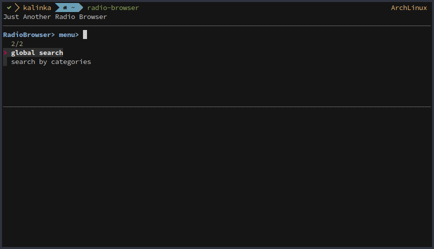
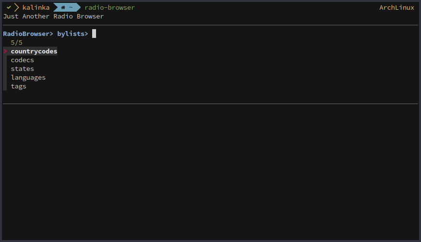
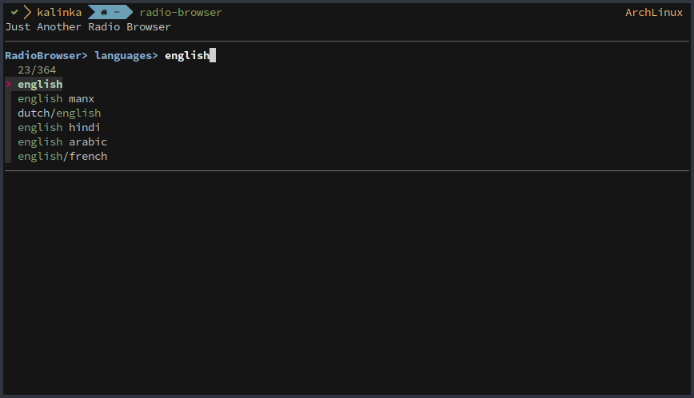
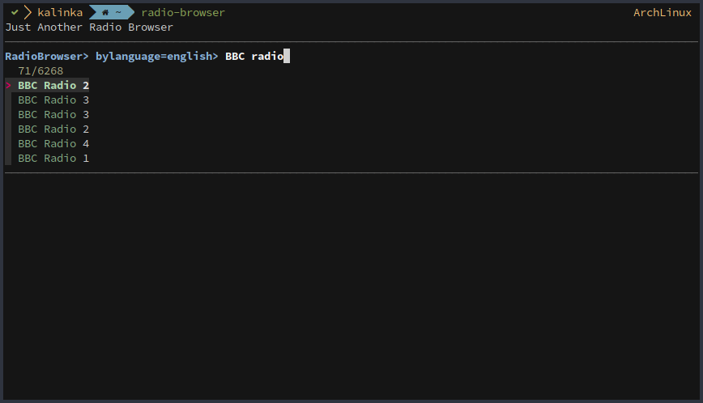

# Just Another Radio Browser

Simple radio browser powered by https://radio-browser.info

## Install

- Dependencies
  - ArchLinux `pacman -S curl jq fzf mpv`
  - Debian `apt-get install curl jq fzf mpv`
- Script
  - Just place it somewhere in your `$PATH`

## Usage

